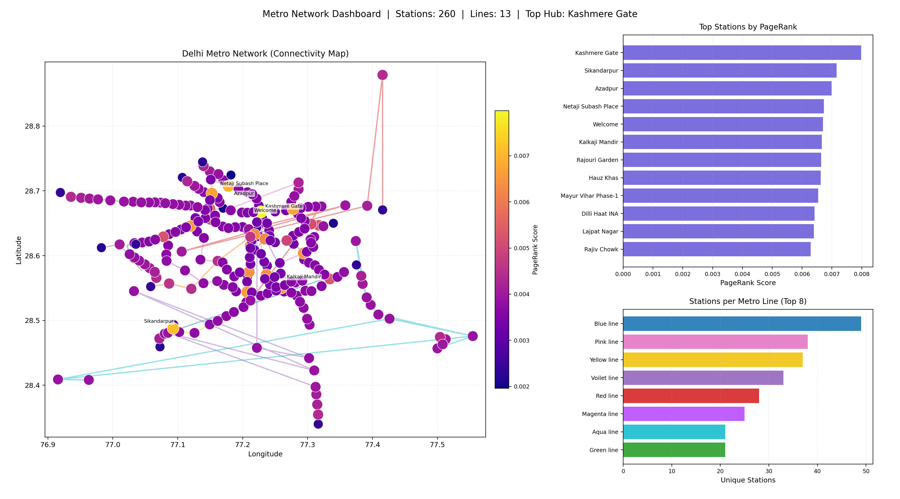
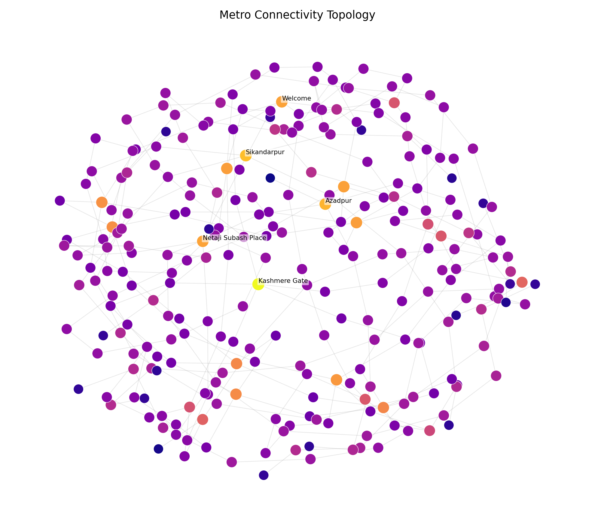

# Metro Station Connectivity Analysis

[](https://www.python.org/)
[](https://spark.apache.org/graphx/)
[](https://networkx.org/)
[](#)

Graph-based analysis of a metro network using **GraphX + Python visualization**, with station ranking via **Degree Centrality** and **PageRank**, plus a **Random Forest demo** for traffic prediction workflow.

---

## What This Project Covers

- Build a directed metro graph from `metro.csv`
- Identify busiest and least connected stations
- Detect isolated stations
- Rank stations using PageRank
- Generate clean dashboard visualizations
- Demonstrate ML pipeline for traffic prediction

---

## Project Structure

| File / Folder | Purpose |
|---|---|
| `metro.csv` | Source dataset (stations, lines, coordinates) |
| `metro_gx.scala` | Spark GraphX script (degree, isolated, PageRank) |
| `metro_assignment.py` | End-to-end assignment runner |
| `metro_visual.py` | Dashboard and panel image generator |
| `dashboard_images/` | Exported dashboard PNG files |
| `metro_nodes/`, `metro_edges/` | Graph artifacts |
| `Metro_Station_Connectivity_Analysis_Report.docx` | Final report document |

---

## Quick Start (Terminal)

```bash
cd /Users/hrituraj/Desktop/clusterproject
python3 -m pip install pandas networkx matplotlib numpy scikit-learn
python3 metro_assignment.py
python3 metro_visual.py
```

---

## Outputs You Get

### Analysis outputs
- Console summary: busiest, least connected, isolated, top PageRank stations
- `station_analysis_with_predictions.csv`

### Dashboard outputs
- `metro_dashboard.png` (combined dashboard)
- `dashboard_images/metro_map_view.png`
- `dashboard_images/metro_connectivity_topology.png`
- `dashboard_images/metro_pagerank_top12.png`
- `dashboard_images/metro_stations_per_line.png`

---

## GraphX Run (Spark Shell)

```bash
cd /Users/hrituraj/Desktop/clusterproject
spark-shell
```

Inside Spark shell:

```scala
:load metro_gx.scala
```

Optional CSV override:

```bash
METRO_CSV_PATH=/full/path/to/metro.csv spark-shell
```

---

## Dashboard Preview

### Full Dashboard


### Connectivity Topology


---

## Method Snapshot

1. Clean and normalize station data  
2. Build directed graph line-wise by station order  
3. Compute degree and PageRank metrics  
4. Render map + topology + ranking visuals  
5. Run Random Forest on graph-derived features

---

## Important Academic Note

The dataset does **not** contain real passenger-count labels.  
The Random Forest stage uses a clearly marked **traffic proxy target** (derived from graph features) to demonstrate ML workflow for assignment purposes.

---

## Repository

GitHub: [Metro-Network-Analysis](https://github.com/hritu1701/Metro-Network-Analysis)
